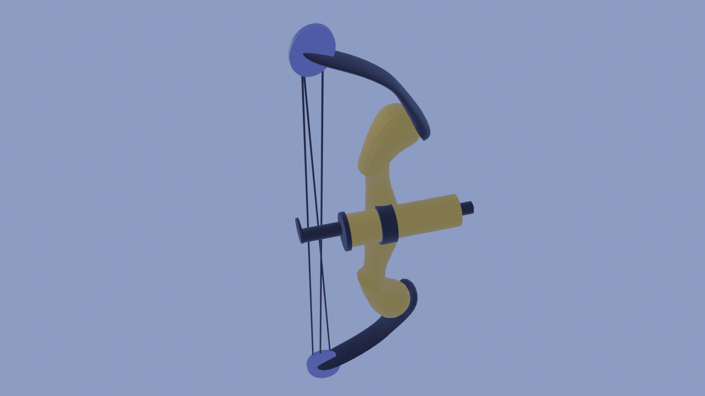
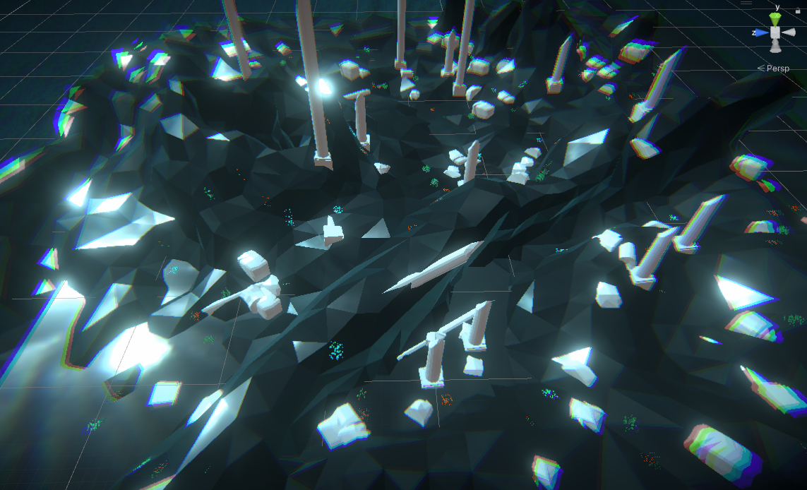

# Thalaussy

## Prerequisites
- Oculus headset
- Unity version [2021.3.15f1](https://unity3d.com/unity/qa/lts-releases)
- In Unity project, install the XR packages through **Window > Package Manager > (on the top) Packages: Unity Registry**:

    - Oculus XR Plugin
    - XR Plugin Management
    - XR Interaction Toolkit (on the top left of the package manager, click the plus and add by name "com.unity.xr.interaction.toolkit")
    - URP (Universal Render Pipeline)

## Images

